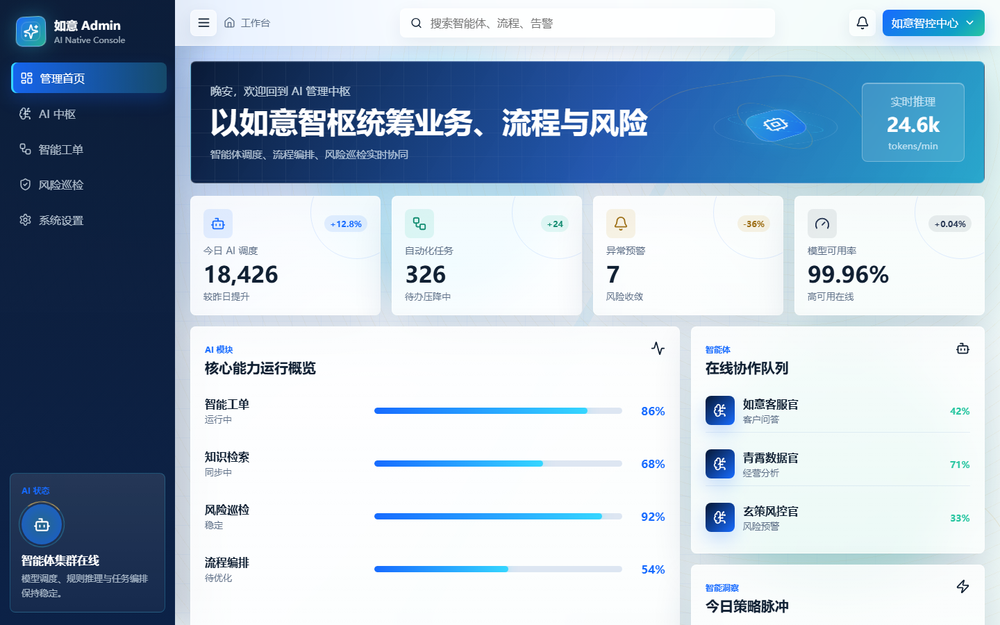

# Ruyi Gin React Admin

如意 Gin React Admin 是一个前后端分离的纯 AI 驱动现代管理系统。项目规划使用 Gin 作为后端服务框架，React 作为前端应用框架；当前阶段优先完成前端管理首页，接口数据暂时通过 mock 方式提供。

## 首页预览



## 项目定位

本系统面向 AI 原生后台管理场景，重点覆盖智能体调度、自动化任务、风险巡检、知识检索、流程编排和运营洞察等能力。当前版本先实现可运行、可展示、可继续扩展的前端首页，为后续接入 Gin API、权限体系、菜单路由和业务模块打基础。

## 技术栈

- 前端框架：React
- 构建工具：Vite
- 图标库：lucide-react
- 数据接口：前端 mock
- 后端规划：Gin
- 包管理：npm

## 目录结构

```text
RuyiGinReactAdmin
├── backend
│   └── .gitkeep
├── docs
│   └── dashboard-home.png
├── frontend
│   ├── index.html
│   ├── package.json
│   ├── package-lock.json
│   └── src
│       ├── App.jsx
│       ├── main.jsx
│       ├── styles.css
│       └── mock
│           └── dashboard.js
├── .gitignore
└── README.md
```

## 当前功能

- 后台管理首页
- 固定顶部导航栏
- 固定左侧菜单栏
- 自适应内容区域
- 内容区超出后独立滚动
- AI 指标卡片
- 核心模块运行进度
- 智能体在线协作队列
- 今日策略脉冲
- 关键事件时间线
- mock 数据加载

## 视觉主题

当前主题为“如意国风科技蓝”，整体方向是现代化、科技感、大气和轻量国风融合。

设计关键词：

- 玄蓝背景
- 青玉高光
- 鎏金点缀
- 玻璃拟态卡片
- 渐变科技背景
- 细网格纹理
- 低频动效
- CSS 3D 中枢视觉

国风表达不采用厚重纹样，而是通过青玉色、鎏金细节、柔和曲线和留白层级体现“如意”气质。

## 布局规范

默认后台管理布局偏好如下，后续功能默认沿用：

- 页面整体宽高等于屏幕宽高
- 顶部固定高度
- 左侧固定宽度
- 内容区自适应剩余空间
- 内容区高度超出后独立滚动
- 不使用营销落地页作为首屏，直接进入管理系统工作台

如后续需求与该布局不一致，应先确认再调整。

## 快速启动

进入前端目录：

```bash
cd frontend
```

安装依赖：

```bash
npm install
```

启动开发服务：

```bash
npm run dev
```

默认访问地址：

```text
http://127.0.0.1:5173/
```

## 构建

```bash
cd frontend
npm run build
```

构建产物输出到：

```text
frontend/dist
```

## 可用脚本

在 `frontend` 目录下可运行：

```bash
npm run dev
npm run build
npm run preview
```

## Mock 数据

当前首页数据来自：

```text
frontend/src/mock/dashboard.js
```

后续接入后端时，可将 mock 方法替换为真实 HTTP 请求，并保持页面组件的数据结构稳定。

## 后续规划

- 初始化 Gin 后端服务
- 增加前端路由
- 增加登录页和权限控制
- 接入真实 API
- 增加系统菜单配置
- 增加表格、表单、详情页等后台通用页面
- 增加统一请求封装
- 增加主题配置能力
- 增加 ESLint、格式化和基础测试

## Git 分支

当前开发分支：

```text
dev
```
